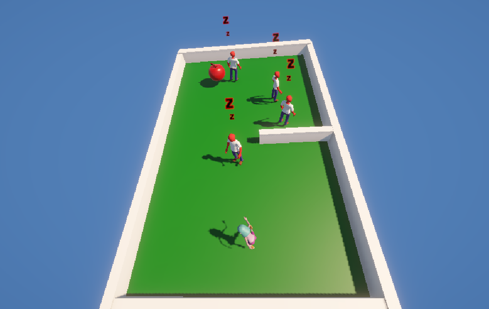
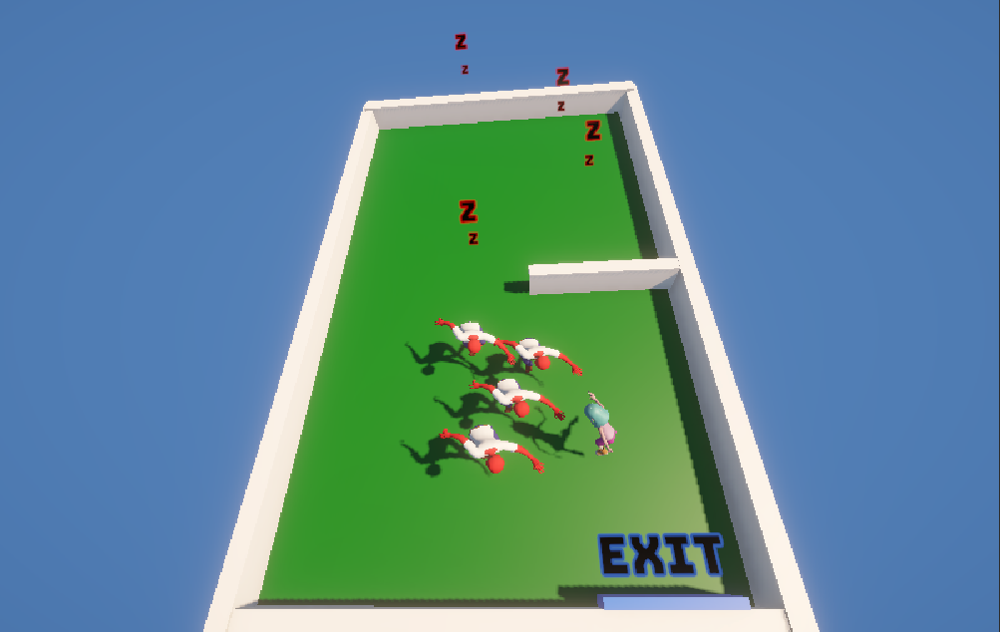

# Mini Escape Game

A 3D escape game created in Unity as a learning project. Collect the apple and escape through the exit door while avoiding AI-controlled enemy characters.

  
  

## Game Concept

**Objective:** Collect the apple and reach the randomly placed exit door without getting caught by enemies.

**Gameplay:** Enemies start asleep and wake up when you collect the apple. They use NavMesh pathfinding to chase the player.

**Randomization:** Each game session randomizes:
* Apple location
* Exit door position
* Enemy count and spawn positions

## Controls

* **WASD:** Movement
* **Shift:** Sprint
* **R:** Restart/randomize level

## Technical Features

### Core Mechanics
* Character movement with sprint functionality
* Physics-based collision detection
* Object collection system
* Procedural enemy spawning
* Level restart system

### AI System
* NavMesh-based enemy pathfinding
* Enemy state system (sleep/awake)
* Dynamic AI behavior triggered by player actions

### Visual & Animation
* Character animations
* DOTween animation library integration
* Visual effects and polish
* UI elements

### Level Design
* Prefab system for reusable objects
* Procedural object placement
* Dynamic level generation

## Technologies Used

* Unity Engine
* C# scripting (with tutorial and AI assistance)
* Unity NavMesh system
* Unity Physics Engine
* DOTween animation library
* Unity Asset Store assets
* easings.net

## Current Status

**Work in Progress** - This project is incomplete and has known issues:
* Custom character model not implemented (using placeholder)
* Some gameplay bugs remain
* Additional features planned but not implemented

## About

This is an educational project created by following a Unity tutorial series. Built for learning Unity fundamentals including NavMesh AI, character movement, physics-based interactions, and procedural generation.
